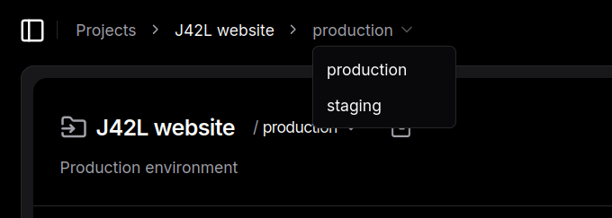
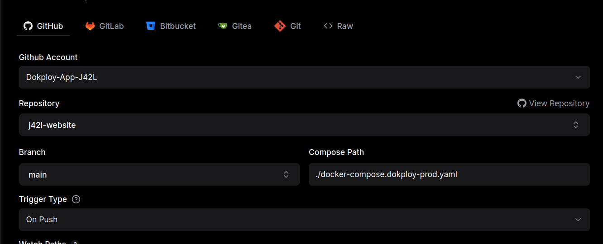
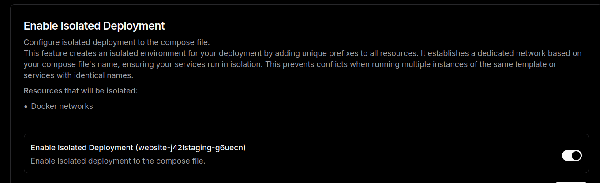

# Junior 42 Lausanne Official Website

## Change log:

[Changelog](./changelog.md)

## A bit about us
[Junior 42 Lausanne](j42l.ch/) is a student association founded in 2023 to bridge the gap between academic learning and professional IT experience. We enable students from 42 Lausanne to work on real-world projects through professional mandates and hands-on development.

Closely connected to [42 Lausanne](42lausanne.ch/) — a member campus of the international [42 Network](42network.org/) — our association benefits from a strong and innovative educational ecosystem while operating independently with a structured, company-like organization. We are also supported by [Junior Entreprise Switzerland](junior-enterprises.ch/).

Our activities include both client-paid mandates and internal development initiatives. Students involved in these projects are responsible for client communication, requirements analysis, proposal drafting, contractual documentation and full-cycle software development. This comprehensive approach ensures not only technical growth but also the acquisition of essential professional and business skills.

 

## J42L website
This website showcases Junior 42 Lausanne's commitment to professionalism and our hands-on approach to real-world IT projects. Designed and developed by [Nguyen NGUYEN](nguyennguyen.ch), [Zelalem ALEMU](zola.dev) and [Dianka MATAYI](linkedin.com/in/dianka-matayi-b4b413209), it reflects our dedication to delivering high-quality solutions, while providing an insight into our structure, services, and the value we bring to clients.

- Tech stack:
	* Next.js
	* Strapi
	* Postgresql
	* Dokploy
- Technologies:
	* Tailwind CSS
	* React
	* Docker
	* Git

 

## Installation
* Requirement
	* Docker compose version v.5.0.1
* Environement example
  You can find complete list of env in our self hosted [vault](https://vault.j42l.ch/)
	*	

		
In ./next (click to expand)

		<pre>
		COMPOSE_BAKE=
		STRAPI_API_TOKEN=
		STRAPI_API_URL=
		STRAPI_URL=</pre>
		

	*	

		
 In ./strapi/ (click to expand)

		<pre>
		STRAPI_URL=
		HOST=
		PORT=
		APP_KEYS=
		API_TOKEN_SALT=
		ADMIN_JWT_SECRET=
		TRANSFER_TOKEN_SALT=
		ENCRYPTION_KEY=
		DATABASE_CLIENT=
		DATABASE_HOST=
		DATABASE_PORT=
		DATABASE_NAME=
		DATABASE_USERNAME=
		DATABASE_PASSWORD=
		POSTGRES_USER=
		POSTGRES_PASSWORD=
		POSTGRES_DB=s
		JWT_SECRET=</pre>
		

* Run locally
	* Dev mode
		<pre>docker compose -f docker-compose.dev.yaml up --build</pre>
	* Production mode
		<pre>docker compose -f docker-compose.staging.yaml up --build</pre>

 

## Development
We use Git flow approach with conventional commit. This mean features are developped in branches, then use Pull Request to merge into `dev` branch to test and prepare for release. Once the `dev` branch is validated, release can be squashed and merge into `main` branch. The main branch should always be working.
 
 
Below are the dev documentation:
* [Next.js module documentation](./next/README.md)
* [Strapi module documentation](./strapi/README.md)

 

## Production
Deployment is done through [Dokploy](https://dokploy.com/) at our [self hosted instance](https://dokploy.j42l.ch/). All credentials are stored in our [self hosted vault](https://vault.j42l.ch/). If you don't have access to any of those services, please contact infra team or your project manager.

### Navigate through our Dokploy
Please refer to Dokploy documentation for general navigation and common usage. We will only documenting setups that are specific to our project.
- The website project is named "J42L website".
- We currently have 2 environments: staging and production that can be navigated using the breadcrumb. Navigate to the correspond service in the environment.

	- Staging environment is deployed automatically from `dev` branch on new push. The site can be accessed at [staging.j42l.ch](staging.j42l.ch). It is password protected to prevent google indexing and public access. Strapi admin site can be accessd at [admin.staging.j42l.ch](admin.staging.j42l.ch). You can find credentials in the [vault](https://vault.j42l.ch/). 
	- Production environment is deployed automatically from `main` branch on new push. The site can be accessed at [j42l.ch](j42l.ch). The site is public and is our main website. Strapi admin site can be accessd at [admin.j42l.ch](admin.j42l.ch). You can find credentials in the [vault](https://vault.j42l.ch/).
- **General tab:** We are interested in the Branch, Compose Path and Trigger Type settings.

	* Staging:
		* Branch: dev 
		* Compose Path: ./docker-compose.dokploy-staging.yaml (staging docker compose)
		* Trigger Type: On Push (when pushing to dev)
	* Production:
		* Branch: main
		* Compose Path: ./dcoker-compose.dokploy-prod.yaml (production docker compose)
		* Trigger Type: On Push (when pushing to main)
* **Environment tab:** Since we deploy through github, naturally we can't push those .env file (please don't). This tab is where we copy all the environment variables we have. Dokploy will then create a .env at the root of the project. The env for staging and production is mostly the same, differences will be listed below.You can find the env list in the [vault](https://vault.j42l.ch/).
	* 

		
Common env (Click to expand)

		<pre>
		APP_KEYS=
		API_TOKEN_SALT=
		ADMIN_JWT_SECRET=
		TRANSFER_TOKEN_SALT=
		ENCRYPTION_KEY=
		DATABASE_CLIENT=
		DATABASE_HOST=
		DATABASE_PORT=
		DATABASE_NAME=
		DATABASE_USERNAME=
		DATABASE_PASSWORD=
		POSTGRES_USER=
		POSTGRES_PASSWORD=
		POSTGRES_DB=
		JWT_SECRET=
		COMPOSE_BAKE=
		STRAPI_API_TOKEN=
		STRAPI_API_URL=
		STRAPI_URL=</pre>
		

	* Staging:
		<pre>
		NEXT_PUBLIC_STRAPI_URL={Staging strapi admin url}
		STAGING=true
		STAGING_USER=
		STAGING_PASSWORD=</pre>
	* Producion:
		<pre>
		NEXT_PUBLIC_STRAPI_URL={production strapi admin url}
		STAGING=false</pre>
* **Domain tab:** Configure and route services to their domain here. Please make sure to select HTTPS with Let's encrypt.
	* Staging:
		* Nextjs:
			* Connect nextjs service to Host staging.j42l.ch
			* Port 3001
			* Keep the rest default
			* Select HTTPS and Let's encrypt
		* Strapi:
			* Connect strapi service to Host admin.staging.j42l.ch
			* Port 1337
			* Keep the rest default
			* Select HTTPS and Let's encrypt
	* Production:
		* Nextjs:
			* Connect nextjs service to Host j42l.ch
			* Port 3001
			* Keep the rest default
			* Select HTTPS and Let's encrypt
		* Strapi:
			* Connect strapi service to Host admin.j42l.ch
			* Port 1337
			* Keep the rest default
			* Select HTTPS and Let's encrypt
* **Logs tab:** You can check container logs here. Very useful.
* **Advanced tab:** Isolated deployment should be enabled. This option make the service use a special container network instead of dokploy-network, so the network is fully isolated even if there are other services in the same project.

 

## FAQ

Why Dokploy?

	Dokploy simplifies deployment by using Github repository and offer a GUI for easier configuration. Their UX/UI is clear and easy to start.
	 
	It is also open sourced and can be self hosted, which J42L do! This setup cuts cost, offers infra team opportunity to train in infrastructure management and retains digital sovereignty.

How do I log in Dokploy?

	You can log in <a href="www.dokploy.j42l.ch"> here</a>
	 
	Ask infra team or your project manager for access.

What are the urls for legal pages?

<ul>
	<li>/legals/impressum</li>
	<li>/legals/privacy-policy</li>
	<li>/legals/terms-of-service</li>
</ul>

What are the urls for service pages?

<ul>
	<li>/services/web</li>
	<li>/services/prototype</li>
	<li>/services/automation</li>
</ul>

How do I change robot.txt?

In <a href="./next/src/app/robots.ts">./next/src/app/robots.ts</a>

How do I change sitemap.xml?

In <a href="./next/src/app/sitemap.ts">./next/src/app/sitemap.ts</a>

